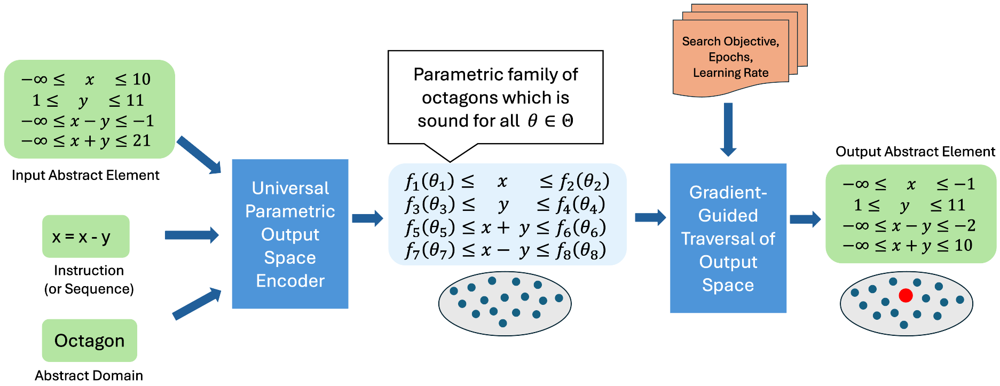

# AbsEvolve: Evolving Abstract Transformers for Gradient-Guided, Adaptable Abstract Interpretation



This is the repository for our PLDI'26 paper: [*Evolving Abstract Transformers for Gradient-Guided, Adaptable Abstract Interpretation*](https://dl.acm.org/doi/10.1145/3808346). Our framework, AbsEvolve, is the first *sound-by-construction* framework for abstract interpretation that is *adaptable* along the precision–efficiency trade-off, combining formal soundness guarantees with the efficiency of gradient-guided optimization.

## Index
- [Installation Instructions](#installation-instructions)
    - [Docker Installation](#docker-installation)
    - [Building from source](#building-from-source)
    - [Smoke Testing](#smoke-testing)
- [Repository Structure and Understanding the Code](#repository-structure-and-understanding-the-code)
    - [Folder Organization](#folder-organization)
    - [Understanding the Code and Modifications](#understanding-the-code-and-modifications)
- [Recreating Paper Experiments](#recreating-paper-experiments)
- [Analyzing New Benchmarks](#analyzing-new-benchmarks)
- [Cite this work](#cite-this-work)

## Installation Instructions

### Docker Installation

1. The quickest way is to use the Docker image `absevolve_image.tar.gz` (hosted on [Zenodo](https://zenodo.org/records/19586617)) which contains all the dependencies and the tool already built. To load the image, run:
    ```
    gzip -dc absevolve_image.tar.gz | docker load
    ```

    Alternatively, you can also build the docker image (takes around 25-30 minutes) from scratch using the provided Dockerfile. It takes care of downloading and installing all the dependencies and building the tool. Use the following command to build the image from the Dockerfile:

    ```
    docker build --no-cache -t absevolve_image .
    ```

2. Once the image is loaded or built as described above, you can run it using:
    ```
    docker run -it --rm absevolve_image
    ```

    If you want logs and plots generated inside Docker to be visible directly in your current host directory (recommended), run the image with the following bind mounts:

    ```
    docker run -it --rm \
        -v "$(pwd)/logs:/home/absevolve/logs" \
        -v "$(pwd)/plots:/home/absevolve/plots" \
        absevolve_image
    ```

    This helps you see and inspect logs and plots immediately from the host filesystem.

### Building from source

If you want to build the tool from source, you can follow the steps below. Note that this is not necessary if you are using the provided Docker image, as it already contains the built tool.

1. The first step is to install the dependencies. Use the following command to install the 
python dependencies listed in [requirements.txt](requirements.txt):

    ```
    pip install -r requirements.txt
    ```

    The next step is to install the dependencies for clam, crab, and elina. You can use the provided script [scripts/install_deps.sh](scripts/install_deps.sh) to install all the dependencies in the `deps` directory and then copy the [.env.example](.env.example) file to `.env`. Use the following command:
    ```
    bash scripts/install_deps.sh && cp .env.example .env
    ```

    If you already have those dependencies installed, you can skip this step and just copy the `.env.example` file to `.env` and change the paths in `.env` to point to your existing installations of the dependencies.

2. Build the project using the provided script [scripts/build.sh](scripts/build.sh) using the command:
    ```
    bash scripts/build.sh scratch
    ```

3. Set the following environment variables in your shell to point to the correct paths for the gurobi license file, symba binary, and runtime library path.
    ```
    export GRB_LICENSE_FILE=${PWD}/experiments/licenses/gurobi.lic
    export SYMBA_BINARY=${PWD}/src/binaries/symba
    export LD_LIBRARY_PATH=${PWD}/src/clam/build/install/lib:${PWD}/deps/install/boost_1_80_0/lib:$LD_LIBRARY_PATH
    ```

### Smoke Testing

1. To quickly test that the tool is working, you can run the following command (inside the Docker container if you are using Docker):

    ```
    python experiments/benchmark_runner.py
    ```

    This will run the analysis on the small examples in [data/custom](data/custom) and generate 
    logs in `logs/custom/`. The `all_checks.json` file generated in the `logs/custom/baseline/` folder should look like this:
    ```json
    {
        "all_checks": {
            "safe": 0,
            "warning": 3,
            "error": 0
        }
    }
    ```
    whereas, the `all_checks.json` file generated in the `logs/custom/aff-gb/` folder should look like this:
    ```json
    {
        "all_checks": {
            "safe": 3,
            "warning": 0,
            "error": 0
        }
    }
    ```

    This shows that analysis using lp solver based transformer (aff-gb) was able to prove all 3 assertions in the examples, while the baseline elina analysis was only able to prove 0 assertions and reported them as warnings. This is expected since the examples are designed to be simple and easily provable by the lp solver based transformer, while being more challenging for the baseline elina analysis. This serves as a sanity check that the tool is working as intended.

2. Subset run for Section 7.1, Figure 5: Figure 5 in Section 7.1 is the experiment showing tradeoff for the linear operators. As a quick test, we will run this experiment on a small subset of benchmarks to quickly validate that the experiment runs and generates expected outputs. To run this subset of experiments, use the following command inside the Docker container:

    ```
    python experiments/run_experiments.py --exp_name 7.1-Linear-Subset
    ```

    This will run the linear tradeoff experiments for a small subset of benchmarks (as specified in [data/sv-benchmarks/nla-digbench/all_benchmarks_subset.csv](data/sv-benchmarks/nla-digbench/all_benchmarks_subset.csv)) and generate logs in `logs/7.1_linear_subset/` and plots in `plots/7.1_linear_subset/`. This command runs in around 7-12 minutes. The expected outputs for this run are available in [paper_experiments_logs/7.1_linear_subset/](paper_experiments_logs/7.1_linear_subset/) and [paper_experiments_plots/7.1_linear_subset/](paper_experiments_plots/7.1_linear_subset/) respectively. The generated plots should look roughly like the ones in [paper_experiments_plots/7.1_linear_subset/](paper_experiments_plots/7.1_linear_subset/). This serves as a quick validation that the experiment runs and generates expected outputs before we run the full set of experiments.


## Repository Structure and Understanding the Code

### Folder Organization

1. The [data](data/) folder contains benchmark inputs. Our primary evaluation suite is [data/sv-benchmarks/nla-digbench](data/sv-benchmarks/nla-digbench), and [data/custom](data/custom) provides small examples (`example1.c`, `example2.c`) to quickly test runs and demonstrate how to add new benchmarks. Every benchmark folder should contain an `all_benchmarks.csv` file listing the `.c` files to run. This CSV is what experiment scripts use to enumerate programs (and users can use to control the programs to analyze).
2. The core implementation is in [src/](src/). The following are the three repositories included in this artifact:
    - [src/clam](src/clam): LLVM front-end and driver layer for the analysis pipeline; this contains code modified from https://github.com/seahorn/clam.
    - [src/crab](src/crab): Static analysis framework and abstract interpretation engine; this contains code modified from https://github.com/seahorn/crab.
    - [src/elina](src/elina): Numerical abstract domain implementations used by the analyzer; this contains code modified from https://github.com/eth-sri/ELINA.

    The diffs for these modifications are provided in [src/patches](src/patches) for clear readability and easier contribution.
3. Build and setup automation is under [scripts/](scripts/) (notably [scripts/install_deps.sh](scripts/install_deps.sh) and [scripts/build.sh](scripts/build.sh)) to install dependencies, configure paths, and build the analysis stack. This is already done in the provided Docker image and runs as part of the image build, but can be used separately if building from source.
4. Experiment orchestration is in [experiments/](experiments/). In particular, [experiments/run_experiments.py](experiments/run_experiments.py) runs the paper experiments, while [results_checker.py](experiments/results_checker.py), [results_parser.py](experiments/results_parser.py), and [plot.py](experiments/plot.py) are used for result validation and plotting.
5. Generated outputs are organized in `logs` and `plots`; [paper_experiments_logs/](paper_experiments_logs/) and [paper_experiments_plots/](paper_experiments_plots/) store reference outputs generated while running the paper experiments.

### Understanding the Code and Modifications

As the tool is implemented by modifying three existing and well-established repositories (clam, crab, elina), we have provided detailed diffs for all the modifications made to these repositories in [src/patches](src/patches). This is to ensure that the changes are clear and easily understandable. If you want to inspect the code changes, you can look at these diffs. If you want to understand how a particular part of the tool works, you can look at the corresponding diff in [src/patches](src/patches) to see the changes made to the original code. A high-level summary of every patch is documented in [src/patches/PATCHES.md](src/patches/PATCHES.md). Morevover, we have also provided:
1. The [scripts/generate_patches.sh](scripts/generate_patches.sh) script to generate these diffs from the modified codebases of clam, crab, and elina. You can use this script to generate the diffs yourself if you want to see how they are generated.
2. The [scripts/apply_patches.sh](scripts/apply_patches.sh) script to apply these diffs to the original codebases of clam, crab, and elina. You can use this script to apply the diffs to the original codebases and recreate the modified codebases of clam, crab, and elina that are used in the tool. This can be useful if you want to understand the changes in the context of the original codebases, or if you want to make further modifications to the codebases and see how they affect the tool.

After making changes to the code in [src/clam](src/clam), [src/crab](src/crab), or [src/elina](src/elina), you don't need to rebuild the tool from scratch. Instead, you can use the incremental mode of [scripts/build.sh](scripts/build.sh) to only rebuild the parts that changed:
```
bash scripts/build.sh incremental
```
This requires that you have already built the tool from scratch at least once (see [Building from source](#building-from-source)).

## Recreating Paper Experiments

The following instructions assume you are running the provided Docker image or have set up the environment as described in the installation instructions and have tested the basic functionality as described in the basic testing section above. Also, the `run_experiments.py` script takes parameter `--logs_folder` to specify the folder where the logs for the experiments will be stored, and `--plots_folder` to specify the folder where the plots for the experiments will be stored. By default, these are set to `logs` and `plots` respectively, but can be changed. We assume that you are using the default values for these parameters, and the logs and plots will be generated in `logs/` and `plots/` folders respectively.

1. Section 7.1, Figure 5: To run the experiments for Section 7.1 and generate the logs for Figure 5 (tradeoff for linear operators), use the following command inside the Docker container:

    ```
    python experiments/run_experiments.py --exp_name 7.1-Linear
    ```
    - Log of this run: In file `logs/7.1_linear.log`
    - Detailed logs: In folder `logs/7.1_linear/`
    - Generated plots: In folder `plots/7.1_linear/`
    - Expected Time: 30-45 minutes (can vary based on machine and load)
    - Reference logs for this run: In folder [paper_experiments_logs/7.1_linear/](paper_experiments_logs/7.1_linear/)
    - Reference plots for this run: In folder [paper_experiments_plots/7.1_linear/](paper_experiments_plots/7.1_linear/)

2. Section 7.2, Figure 7: To run the experiments for Section 7.2 and generate the logs for Figure 7 (full tradeoff with linear and quadratic), use the following command inside the Docker container:

    ```
    python experiments/run_experiments.py --exp_name 7.2-Full
    ```
    - Log of this run: In file `logs/7.2_full.log`
    - Detailed logs: In folder `logs/7.2_full/`
    - Generated plots: In folder `plots/7.2_full/`
    - Expected Time: 40-60 minutes (can vary based on machine and load)
    - Reference logs for this run: In folder [paper_experiments_logs/7.2_full/](paper_experiments_logs/7.2_full/)
    - Reference plots for this run: In folder [paper_experiments_plots/7.2_full/](paper_experiments_plots/7.2_full/)

3. Section 7.1, Figure 6: To run the experiments for Section 7.1 and generate the logs for Figure 6 (comparision of gurobi based transformer and our transformer), use the following command inside the Docker container:

    ```
    python experiments/run_experiments.py --exp_name 7.1-Solver-Comp
    ```
    - Log of this run: In file `logs/7.1_solver_comp.log`
    - Detailed logs: In folder `logs/7.1_solver_comp/`
    - Generated plots: In folder `plots/7.1_solver_comp/`
    - Expected Time: 45-60 minutes (can vary based on machine and load)
    - Reference logs for this run: Too large to store in the repo, but is present in the artifact
    on [Zenodo](https://zenodo.org/records/19586617) inside `AbsEvolve_Artifact_Code` at `paper_experiments_logs/7.1_solver_comp/`.
    - Reference plots for this run: In folder [paper_experiments_plots/7.1_solver_comp/](paper_experiments_plots/7.1_solver_comp/)

4. [Optional] Appendix-D.3-No-Collation Experiments: This is optional as it is not part of the main experiments and was done to evaluate the impact of collation. To run the experiments for the no-collation setting, use the following command inside the Docker container:

    ```
    python experiments/run_experiments.py --exp_name Appendix-D.3-No-Collation
    ```

    - Log of this run: In file `logs/appendix_d.3_full_no_collation.log`
    - Detailed logs: In folder `logs/appendix_d.3_full_no_collation/`
    - Generated plots: In folder `plots/appendix_d.3_full_no_collation/`
    - Expected Time: 60-75 minutes (can vary based on machine and load)
    - Reference logs for this run: In folder [paper_experiments_logs/appendix_d.3_full_no_collation/](paper_experiments_logs/appendix_d.3_full_no_collation/)
    - Reference plots for this run: In folder [paper_experiments_plots/appendix_d.3_full_no_collation/](paper_experiments_plots/appendix_d.3_full_no_collation/)

5. [Optional] Section 7.1, Symba Baseline (lines 819-822): This is optional as it is not part of the main experiments and was done to evaluate the performance of the Symba baseline. To run the experiments for the Symba baseline, use the following command inside the Docker container:

    ```
    python experiments/run_experiments.py --exp_name 7.1-Symba-Baseline
    ```
    - Log of this run: In file `logs/7.1_symba_baseline.log`
    - Detailed logs: In folder `logs/7.1_symba_baseline/`
    - Expected Time: 2 hrs to 2hrs 30 mins (can vary based on machine and load. Also, the Symba solver is significantly slower than the lp solver based transformer, which is why this run takes much longer)
    - Reference logs for this run: In folder [paper_experiments_logs/7.1_symba_baseline/](paper_experiments_logs/7.1_symba_baseline/)

These experiments together support all the claims made in the paper!

*Validating and Inspecting Results:* As described above, the logs and plots generated while running the experiments are available in [paper_experiments_logs/](paper_experiments_logs/) and [paper_experiments_plots/](paper_experiments_plots/) respectively. You can use these reference logs and plots to validate your runs and ensure that you are getting consistent results. You can also inspect these logs to understand the detailed outputs of the experiments. The logs can be recreated using commands above. You can also recreate the plots using the paper logs by running:

```
python experiments/plot.py --logs_folder paper_experiments_logs --plots_folder paper_plots
```

## Analyzing New Benchmarks

To add new benchmarks, you can create a new folder under [`data/`](data/) (e.g., `data/new_benchmarks/`) and add your benchmark `.c` files there. You also need to create an `all_benchmarks.csv` file in that folder which lists the names of the `.c` files to run. The format of the `all_benchmarks.csv` file should be as follows:

```benchmark_file
Filename
benchmark1.c
benchmark2.c
benchmark3.c
...
```

The [scripts/run_experiments.py](scripts/run_experiments.py) script can be used to read how to use [experiments/benchmark_runner.py](experiments/benchmark_runner.py) and use the `BenchmarkRunner` class to run the analysis on these new benchmarks. The `BenchmarkRunConfig` class is used to configure the analysis settings for the new benchmarks. An example of how to use the `BenchmarkRunner` and `BenchmarkRunConfig` classes to run the analysis on new benchmarks is provided below:

```python
from benchmark_runner import BenchmarkRunner, BenchmarkRunConfig
from utils import get_project_root

PROJECT_ROOT = get_project_root()

runner = BenchmarkRunner()
dataset_folder = f"{PROJECT_ROOT}/data/new_benchmarks/"
output_base_folder = f"{PROJECT_ROOT}/logs/new_benchmarks"
abstract_domain = "elina-zones"

config = BenchmarkRunConfig(abs_dom=abstract_domain)

# Baseline
bl_output_folder = f"{output_base_folder}/baseline"
runner.run_using_config(config, dataset_folder, bl_output_folder, logger)

# LP-solver transformer (default solver when affine precision level is set to "affine-full")
config.aff_prec_level = "affine-full"
gb_output_folder = f"{output_base_folder}/aff-gb"
runner.run_using_config(
    config,
    dataset_folder,
    gb_output_folder,
    logger,
    bl_outp_folder=bl_output_folder,
)

# Dual-solver transformer (lin_solver_config determines the solver used for the linear operators)
config.lin_solver_config = {
    "name": "dual",
    "num_epochs" : "5"
}
dual_output_folder = f"{output_base_folder}/aff-dual"
runner.run_using_config(
    config,
    dataset_folder,
    dual_output_folder,
    logger,
    bl_outp_folder=bl_output_folder,
)
```

## Cite this work

If you use our code or the results from our work, please cite our paper:

```bibtex
@article{gomber2026evolving,
        author = {Gomber, Shaurya and Banerjee, Debangshu and Singh, Gagandeep},
        title = {Evolving Abstract Transformers for Gradient-Guided, Adaptable Abstract Interpretation},
        year = {2026},
        issue_date = {June 2026},
        publisher = {Association for Computing Machinery},
        address = {New York, NY, USA},
        volume = {10},
        number = {PLDI},
        url = {https://doi.org/10.1145/3808346},
        doi = {10.1145/3808346},
        journal = {Proc. ACM Program. Lang.},
        month = jun,
        articleno = {268},
        numpages = {25},
        keywords = {Adaptable Analysis, Efficient and Precise Abstract Interpretation, Gradient-Guided Optimization, Parametric Abstract Outputs}
}
```
